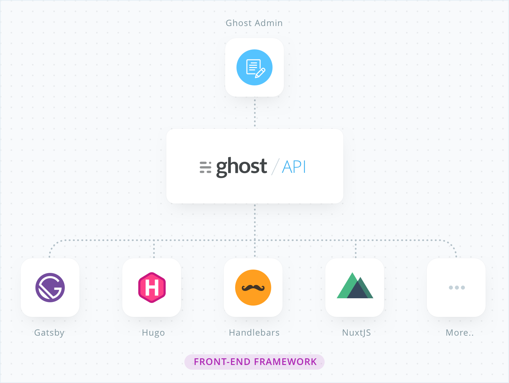

# TBZM300
Dokumentation Modul 300

# TBZM300
Dokumentation Modul 300

## Inhaltsverzeichnis

* 01 - [K1](#k1-)
* 02 - [K2](#k2-)
* 03 - [K3](#k3-)
* 04 - [K4](#k4-)
* 05 - [K5](#k5-)
* 05 - [K6](#k6-)

## K1  
> [⇧ **Nach oben**](#inhaltsverzeichnis)

Die Umgebung wurde bereits in der LB2 eingerichtet und eine Dokumentation findet man unter:

## K2  
> [⇧ **Nach oben**](#inhaltsverzeichnis)

Die einzelnen Git Dokumentationen sind in der LB2-Arbeit zu finden unter folgendem Link:

**Git**

**Branch** 

Ein Branch ist eine isolierte Entwicklungszone. Hier testet man einzelne Skripts oder Programme bevor sie in die Produktion kommen.
Man kann Beispielsweise eine Entwicklungszone mit git branch "Name" einrichten und von dort aus ausserhalb der Produktiven Zone arbeiten. Da man getrennt ist, wird die "master" Umgebung nicht beinträchtig. 

**Tags** 

Tags sind Referenzen für eine bestimmte Version einer GIT Datei

**Forks** 

Wenn man ein bestimmmtes GIT Repository forked, dann zieht man eine eigene Version auf das eigene GIT

**Commands**

| Commands | Bedeutung |
| -------------- | -------------- |
| git branch | Mit diesem Befehl listet man alle Branches im eigenem Repo auf. Ebenfalls ist es möglich eigene Branches zu erstellen oder zu dem genannten Branch zu wechseln |
| git checkout | Mit diesem Befehl wechselt man einen Branch |
| git commit | Damit ruft man eine Bestätigung für eine gespeicherte Aktion aus |
| git clone | Mit diesem Befehl klont man lokal ein Repository aus einem Git |

## Links

* [Git scm Basic Branches](https://git-scm.com/book/en/v2/Git-Branching-Basic-Branching-and-Merging) 
* [Git Buch](https://git-scm.com/book/de/v2)

**Persönlicher Wissensstand**
Da ich das Wahlmodul 901 besuche, weiss ich im Grunde, wie ich eigene Container erstellen kann. Linux benutze ich sowieso täglich und das Vagrant habe ich für die LB2 angewendet.

## K3  
> [⇧ **Nach oben**](#inhaltsverzeichnis)

#### Netzwerkplan

    +------------------------------------------------------------------------------------------------+
    | Netzwerk: 10.0.2.0/24                                                                          |
    |+----------------------------------------------------------------------------------------------+|
    || Hostname: ch-web01                                                                           ||
    || OS: Ubunt  16.04 LTS                                                                         ||
    ||                                                                                              ||
    || LAN enp3s0: 10.0.2.15                                                                        ||
    || Docker docker0: 172.17.0.1                                                                   ||
    || Port: 80, 443, 8080, 8082                                                                    ||
    || NAT: 32760-32780, 80, 8080, 8081, 8082, 3306, 2368                                           ||
    ||                                                                                              ||
    || +-----------------------------------------+      +-----------------------------------------+ ||
    || | Ghost Container                       |      | Apache Container                        | ||
    || | Ports: 8080, 2368                       |      | Ports: 80, 443, 8081                    | ||
    || | Version: 2.60.3                         |      | Version: 14.04                          | ||
    || | Plugins: git-client, docker-engine      |      | Plugins: -                              | ||
    || |                                         |      |                                         | ||
    || |                                         |      |                                         | ||
    || +-----------------------------------------+      +-----------------------------------------+ ||
    |+----------------------------------------------------------------------------------------------+|        |                                                                                                |
    |+----------------------------------------------------------------------------------------------+|
    || Hostname: ch-db01                                                                            ||
    || OS: Ubunt  16.04 LTS                                                                         ||
    ||                                                                                              ||
    || LAN enp3s0: 10.0.2.16                                                                        ||
    || Docker docker0: 172.17.0.2                                                                   ||
    || Port: 80, 443, 3306                                                                          ||
    || NAT: 32760-32780, 80, 8080, 8081, 8082, 3306,                                                ||
    ||                                                                                              ||
    || 
    |+----------------------------------------------------------------------------------------------+|
    +------------------------------------------------------------------------------------------------+

#### Docker Befehle

| Command | Bedeutung |
| ---- | ---- |
| docker build "Source" | Erstellt ein Docker image | 
| docker images | Zeigt alle verfügbare Docker images |
| docker rmi "image" | Löscht ein Docker image |
| docker run "image" | startet ein Docker image |
| docker exec it "Container" \bin\bash | Exploriert einen Container |

## K4  

**Was ist Docker?**
Docker ist ein Open-Source-Projekt zur Automatisierung der Bereitstellung von Anwendungen als portable Container, die in der Cloud oder vor Ort ausgeführt werden können. Docker-Image-Container können unter Linux und Windows ausgeführt werden. Windows-Bilder können jedoch nur auf Windows-Rechnern ausgeführt werden und Linux-Bilder können auf Linux-Rechnern und Windows-Rechnern, wobei der Host ein Server oder eine VM ist.

Architektur Docker:

**Sicherheitseinstellungen Docker**
Für alle Applikationen kann ein andere Host Port weitergeleitet werden. Diese definiert man mit der Zeile EXPOSE.
Anderweitige Einstellungen können vorgenommen werden, indem man einem User die Berechtigung gibt einen gewissen Container anzupassen.
Sonst noch kann man Gruppeneinstellungen vornehmen, damit nur eine gewisse Benutzergruppe einen Container verwalten kann.

**Was ist Ghost?**
Ghost ist eine vollständig Open Source, anpassungsfähige Plattform für den Aufbau und Betrieb einer modernen Online-Publikation. 

Ghost Architektur:

## K5  

**Vergleich Vorwissem**

**Reflexion**

## K6  

**CMS Ghost**

[Documentation Ghost](https://ghost.org/docs/)