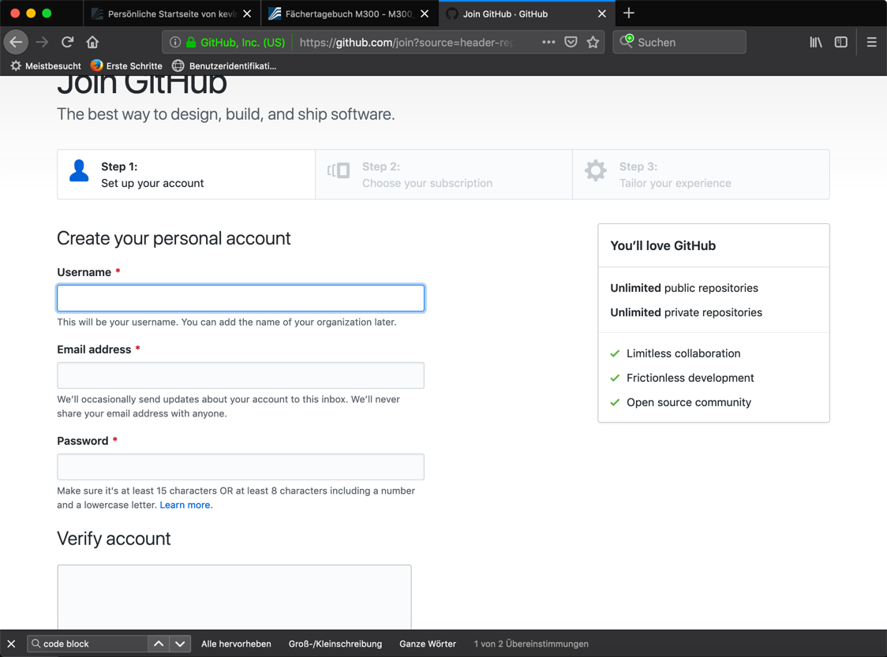
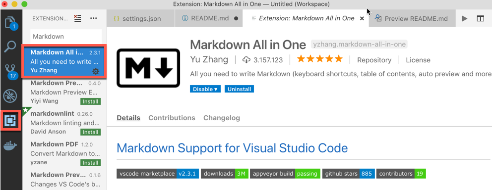

# TBZM300
Dokumentation Modul 300

## K1
### VirtualBox
***
Virtual Box ist eine Virtualisierungssoftware von Oracle. Wir benutzen dieses Programm, um mit Vagrant VMs zu erstellen.

Auf folgender Seite kann VirtualBox installiert werden: https://www.virtualbox.org/wiki/Downloads

#### Installation
***
1. In den Sicherheitseinstellungen vom Mac muss der Zugriff für VirtualBox erlaubt werden

2. Danach geht man normal die Installation durch und wählt den Pfad aus, wo VirtualBox installiert werden soll

### Vagrant
***
Vagrant ist ein Tool zum Erstellen und Verwalten von Umgebungen virtueller Maschinen in einem einzigen Workflow.

Auf folgender Seite kann Vagrant installiert werden: https://www.vagrantup.com/downloads.html

#### Installation
***
1. Die Installationsdatei muss ausgewählt und ausgeführt werden.
2. Danach kann man die normale Installation durchführen und wählt den Pfad aus, wo Vagrant installiert werden soll

### Visualstudio-Code
***
Visualstudio Code ist ein Editor für verschiedene Programmiersprachen. Es können Externsions installiert werden, um weitere Sprachen darin zu programmieren.

Auf der folgender Seite kann Visualstudio Code installiert werden: https://code.visualstudio.com/

### SSH-Key für Client erstellt
***
Mittels eines SSH-Keys ist es möglich auf einem Server zuzugreifen. Dazu führt man folgende Schritte aus.

1. Terminal (Bash) öffnen
2. Folgenden Befehl mit der Account-E-Mail von GitHub einfügen: 
`ssh-keygen -t rsa -b 4096 -C "beispiel@beispiel.com"`
3. Neuer SSH-Key wird erstellt: 
`Generating public/private rsa key pair.`
4. Bei der Abfrage, unter welchem Namen der Schlüssel gespeichert werden soll, die Enter-Taste drücken (für Standard): 
`Enter a file in which to save the key (~/.ssh/id_rsa): [Press enter]`
5. Nun kann ein Passwort für den Key festgelegt werden. Ich empfehle dieses zu setzen und anschliessend dem SSH-Agent zu hinterlegen, sodass keine erneute Eingabe (z.B. beim Pushen) notwendig ist: 
`Enter passphrase (empty for no passphrase): [Passwort]` 
`Enter same passphrase again: [Passwort wiederholen]`

## K2

### GitHub oder Gitlab-Account erstellt
***
Um einen GitHub Account zu erstellen, öffnet man die Seite https://github.com/join?source=header-home und folgt dort die einzelnen Steps
1. Username auswählen
2. Eine gültige E-Mailadresse auswählen
3. Passwort auswählen
4. Verifieren, dass man kein Roboter ist

### Git-Client wurde verwendet
***
Der Git-Installer kann unter folgender Seite installiert werden: https://git-scm.com/downloads

**Commands**
| Commands | Bedeutung |
| -------------- | -------------- |
| git branch | Mit diesem Befehl listet man alle Branches im eigenem Repo auf. Ebenfalls ist es möglich eigene Branches zu erstellen oder zu dem genannten Branch zu wechseln |
| git checkout | Mit diesem Befehl wechselt man einen Branch |
| git commit | Damit ruft man eine Bestätigung für eine gespeicherte Aktion aus |
| git clone | Mit diesem Befehl klont man lokal ein Repository aus einem Git |
| git add | Mit diesem Befehl kann man eine Datei zum Upload hinzufügen |
| git push | Mit Git Push wird ein Upload bzw. ein Push durchgeführt | 

### Markdown-Editor ausgewählt und eingerichtet
Das Markdown ist eine zusätzliche Extension, um Git Dokumentationen zu schreiben.
Die Extension kann im VisualStudio Codes installiert werden.

Mardown All in One von Yu Zhang

### Dokumentation ist als Markdown vorhanden
Die Dokumentation wurde im VisualStudio Code mit der Extension MarkdownAllInOne geschrieben.

## K3
